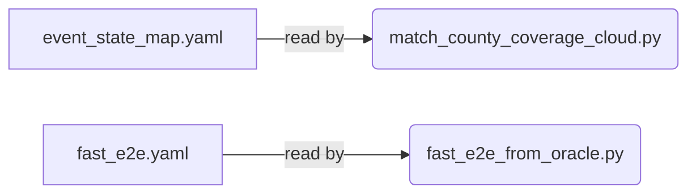

# C4 Code-Level Documentation: configs/

## 1. Overview Section
- **Name**: Configurations
- **Description**: YAML configuration files governing project hyperparameters and execution boundaries.
- **Location**: [`configs/`](./configs/)
- **Language**: YAML
- **Purpose**: Decouples hardcoded paths, state name mappings, SLOSH raster identifiers, and pipeline flags from the core logic scripts to ensure ease of deployment across multiple AWS/OCI cluster runs.

## 2. Code Elements Section
*(Note: As this directory contains YAML config state rather than executable code, elements are defined by their structure rather than functional signatures)*

### Files / Modules
#### `fast_e2e.yaml`
- **Description**: Main execution parameters for the End-to-End data pipeline.
- **Fields**: Defines expected paths to `nsi_baseline` data, the `fast_engine_dir`, spatial CRS conversions, and toggles for exporting debug CSVs.

#### `event_state_map.yaml`
- **Description**: Routing map correlating hurricane/event identifiers.
- **Fields**: Maps `{Event}_{Year}` to SLOSH basins and targeted states (e.g. `HELENE_2024` maps to FL, GA, NC, SC parameters).

## 3. Dependencies Section
- **Internal Dependencies**: Required by `scripts/fast_e2e_from_oracle.py` and `scripts/duckdb_fast_pipeline.py`.
- **External Dependencies**: Requires `pyyaml` for parsing at runtime.

## 4. Relationships Section

