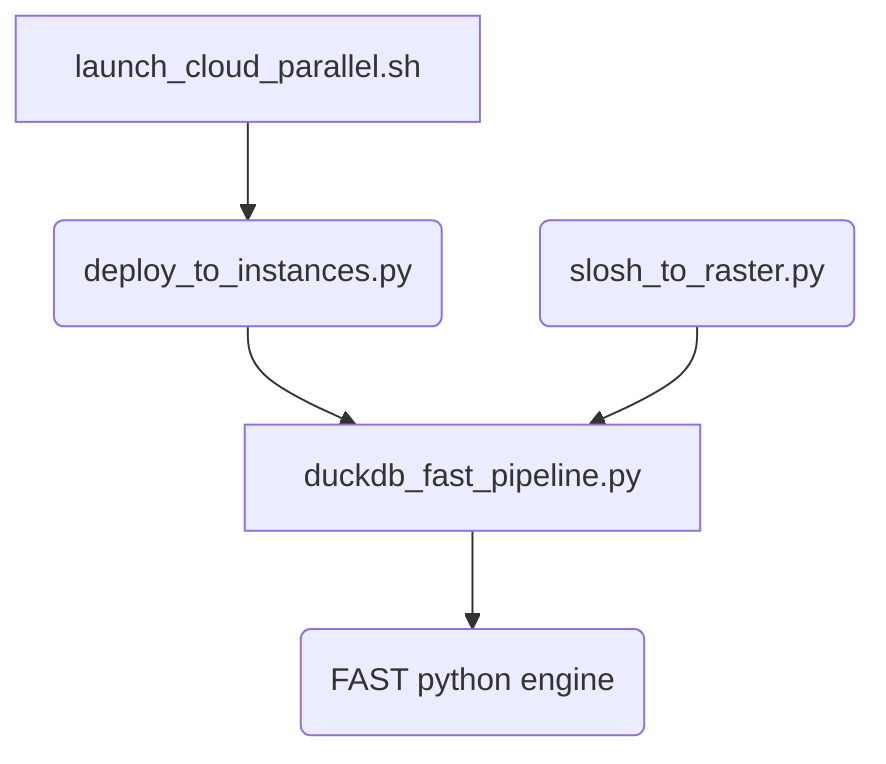

# C4 Code-Level Documentation: scripts/

## 1. Overview Section
- **Name**: ETL & Parallel Execution Scripts
- **Description**: The execution backbone of the pipeline doing geo-spatial intersection, SLOSH integration, ML modeling, and cloud lifecycle management.
- **Location**: [`scripts/`](./scripts/)
- **Language**: Python 3.10+, Bash
- **Purpose**: Perform distributed spatial joins between NSI structures and SLOSH Rasters, prepare FAST CSVs, run FAST headless engine, and coordinate AWS/OCI EC2 spot instances.

## 2. Code Elements Section

### Core Data Pipeline (`duckdb_fast_pipeline.py` & `fast_e2e_from_oracle.py`)
- **Signature**: `main(state: str, raster_name: str, config_path: str) -> None`
- **Description**: Reads Parquet inputs, triggers ST_MakeValid geometries via DuckDB, performs spatial join against SLOSH Depth Grids, and exports results.
- **Dependencies**: `duckdb`, `pyarrow`, `geopandas`

### Raster Processing (`slosh_to_raster.py`)
- **Signature**: `convert_to_raster(basin: str, category: int, tide: str) -> str`
- **Description**: Translates NOAA MOM Grids (.shp/points) into `.tif` Rasterio images holding depth pixel attributes.
- **Dependencies**: `rasterio`

### Cloud Controllers (`launch_cloud_parallel.sh`, `deploy_to_instances.py`)
- **Signature**: Bash scripting / AWS Boto3 equivalents
- **Description**: Orchestrates multi-node EC2 spins, clones git repo, sets up Anaconda, kicks off `e2e` scripts, then automatically terminates via `terminate_parallel.sh`.

## 3. Dependencies Section
- **Internal Dependencies**: `configs/` (yaml files), `FAST-main/` (FAST engine).
- **External Dependencies**: 
  - AWS CLI/Boto3, OCI CLI
  - DuckDB, PyArrow, GeoPandas, Rasterio
  - Bash/POSIX utilities

## 4. Relationships Section

