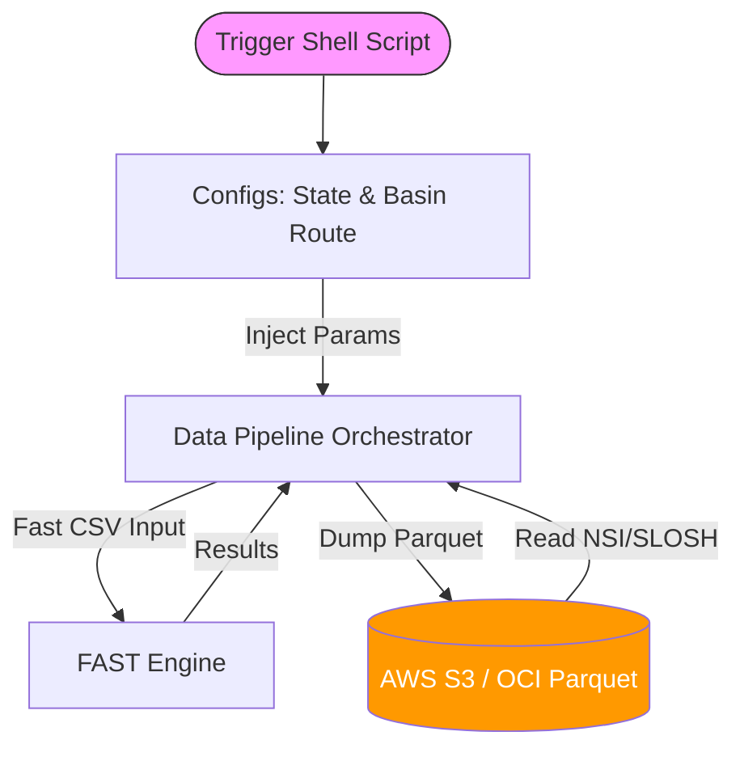

# C4 Component-Level Master Index

## 1. System Components Section

### Pipeline Orchestrator Component
- **Description**: The core Python component (`duckdb_fast_pipeline.py`, `fast_e2e_from_oracle.py`) responsible for spatial matching of NSI and SLOSH data via DuckDB in-memory parallelization.
- **Link**: [`c4-code-scripts.md`](./c4-code-scripts.md)

### FAST Engine Wrapper Component
- **Description**: A wrapper invoking FEMA's FAST binary algorithms to output economic and structural loss parameters.
- **Link**: [`c4-code-fast-main.md`](./c4-code-fast-main.md)

### Configuration State Component
- **Description**: YAML-driven mappings connecting storms to affected regions, preventing hardcoded values inside execution logic.
- **Link**: [`c4-code-configs.md`](./c4-code-configs.md)

## 2. Component Relationships Diagram

