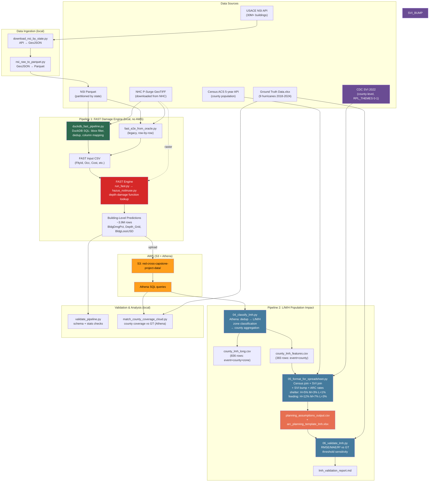

# End-to-End Pipeline Architecture

## Legend

| Color | Meaning |
|-------|---------|
| Green | Primary local pipeline (preferred) |
| Red | FAST engine core |
| Blue | L/M/H population impact pipeline |
| Purple | SVI data source + conditional bump |
| Orange | AWS services (S3/Athena) |
| Coral | Final deliverable |

## AWS Dependency Boundary

Only these scripts require AWS credentials (`boto3`):
- `04_classify_lmh.py` — Athena query
- `match_county_coverage_cloud.py` — Athena + S3

Everything else runs locally. If FAST prediction CSVs are available on local disk, the Athena query in 04 could be replaced with DuckDB to eliminate AWS entirely.
