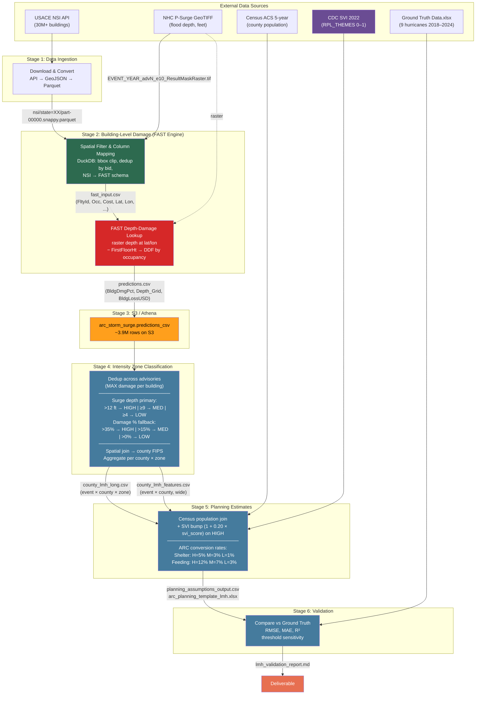

# End-to-End Pipeline Architecture

## Legend

| Color | Meaning |
|-------|---------|
| Green | Data preparation (DuckDB) |
| Red | FAST damage engine |
| Orange | AWS storage (S3/Athena) |
| Blue | Population impact pipeline |
| Purple | SVI data source |
| Coral | Final deliverable |

## Notes

- **Edges show output file names** — each arrow is labeled with the artifact produced by that step.
- **Stage 2 runs locally**; Stage 3 onwards requires AWS credentials (`boto3`) for Athena queries.
- If prediction CSVs are available locally, the Athena dependency can be replaced with DuckDB.
