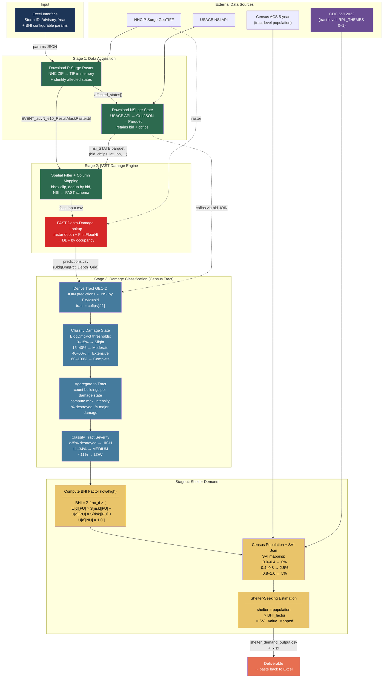

# Shelter Demand Pipeline (Colab Notebook)

## Legend

| Color | Meaning |
|-------|---------|
| Dark blue | User input (Excel) |
| Green | Data acquisition & preparation |
| Red | FAST damage engine |
| Blue | Damage classification & tract aggregation |
| Gold | BHI computation & shelter demand |
| Purple | SVI data source |
| Coral | Final deliverable |

## Notebook Cell Mapping

| Cell | Stage | Node |
|------|-------|------|
| 2 | Input | Excel params JSON |
| 3 | 1 | Download P-Surge Raster |
| 4 | 1 | Download NSI per State |
| 5 | 2 | Spatial Filter + Column Mapping |
| 6 | 2 | FAST Engine |
| 7 | 3 | Derive Tract GEOID |
| 8 | 3 | Classify Damage State + Aggregate |
| 9 | 3 | Classify Tract Severity |
| 10 | 4 | Compute BHI Factor |
| 11 | 4 | Census + SVI Join |
| 12 | 4 | Shelter-Seeking Estimation |
| 13 | — | Export |
